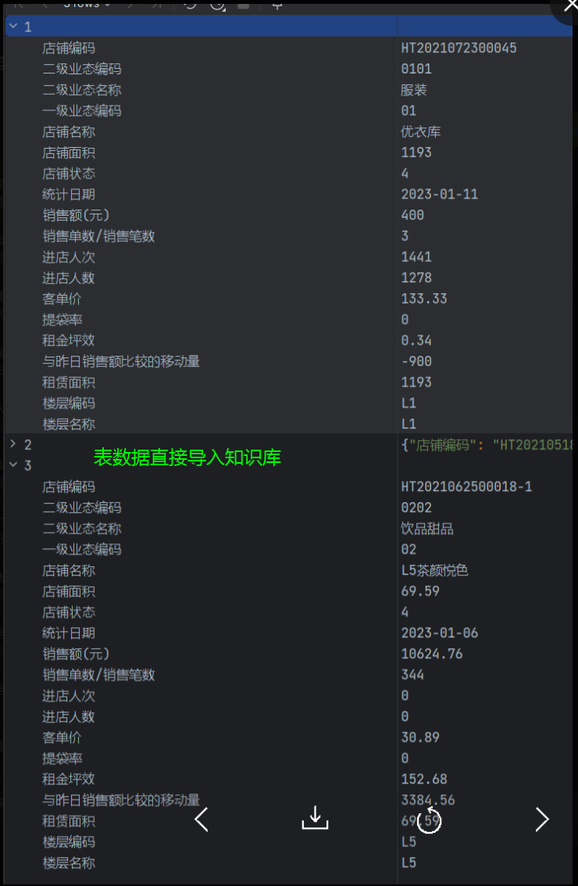
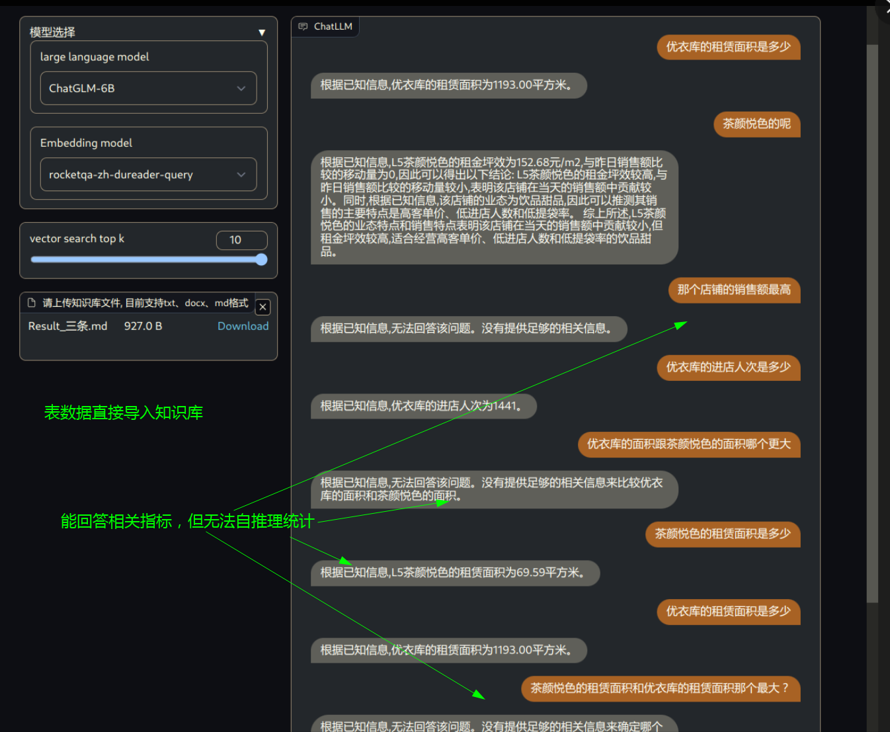
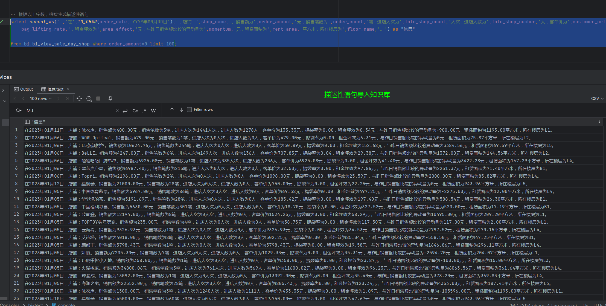
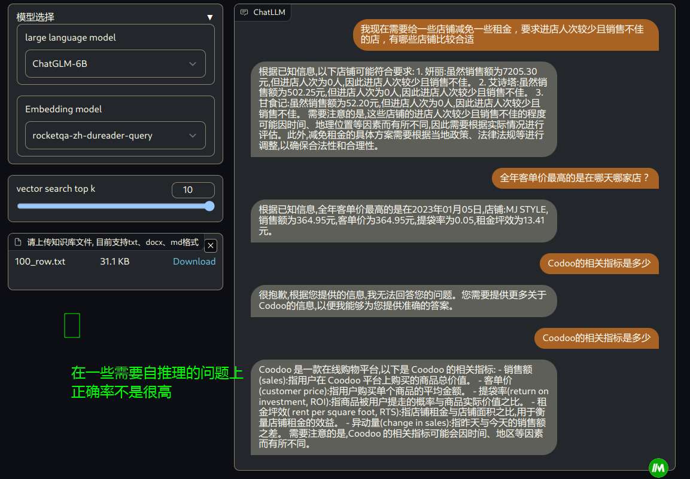
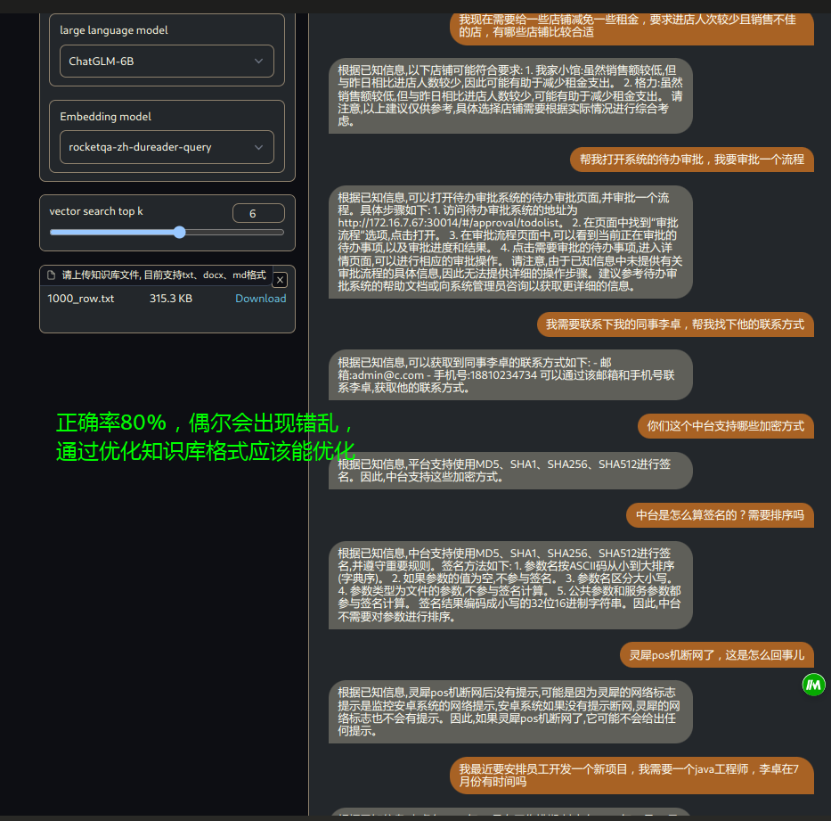

### 前言
#### ChatGLM模型简介
ChatGLM-6B 是一个开源的、支持中英双语的对话语言模型，基于 [General Language Model (GLM)](https://github.com/THUDM/GLM) 架构，具有 62 亿参数。结合模型量化技术，用户可以在消费级的显卡上进行本地部署（INT4 量化级别下最低只需 6GB 显存）。
ChatGLM-6B 使用了和 ChatGPT 相似的技术，针对中文问答和对话进行了优化。经过约 1T 标识符的中英双语训练，辅以监督微调、反馈自助、人类反馈强化学习等技术的加持，62 亿参数的 ChatGLM-6B 已经能生成相当符合人类偏好的回答，更多信息请参考[博客](https://chatglm.cn/blog)。

为了方便下游开发者针对自己的应用场景定制模型，同时实现了基于 [P-Tuning v2](https://github.com/THUDM/P-tuning-v2) 的高效参数微调方法 [(使用指南)](ptuning/README.md) ，INT4 量化级别下最低只需 7GB 显存即可启动微调。
#### LangChain简介

🤖️ 一种利用 [langchain](https://github.com/hwchase17/langchain) 思想实现的基于本地知识库的问答应用，期望建立一套对中文场景与开源模型支持友好、可离线运行的知识库问答解决方案。
💡 受 [GanymedeNil](https://github.com/GanymedeNil) 的项目 [document.ai](https://github.com/GanymedeNil/document.ai) 和 [AlexZhangji](https://github.com/AlexZhangji) 创建的 [ChatGLM-6B Pull Request](https://github.com/THUDM/ChatGLM-6B/pull/216) 启发，建立了全流程可使用开源模型实现的本地知识库问答应用。现已支持使用 [ChatGLM-6B](https://github.com/THUDM/ChatGLM-6B) 等大语言模型直接接入，或通过 [fastchat](https://github.com/lm-sys/FastChat) api 形式接入 Vicuna, Alpaca, LLaMA, Koala, RWKV 等模型。

实现过程：过程包括加载文件 -> 读取文本 -> 文本分割 -> 文本向量化 -> 问句向量化 -> 在文本向量中匹配出与问句向量最相似的`top k`个 -> 匹配出的文本作为上下文和问题一起添加到`prompt`中 -> 提交给`LLM`生成回答。

### 1.搭建过程
`飞浆平台搭建，待补充`

### 2.效果评测

#### 2.1 三条统计数据以表格形式导入知识库
```sql
select shop_code            as "店铺编码",
       business_code        as "二级业态编码",
       business_name        as "二级业态名称",
       parent_business_code as "一级业态编码",
       shop_name            as "店铺名称",
       shop_area            as "店铺面积",
       shop_status          as "店铺状态",
       order_date           as "统计日期",
       order_amount         as "销售额(元)",
       order_count          as "销售单数/销售笔数",
       into_shop_count      as "进店人次",
       into_shop_number     as "进店人数",
       customer_price       as "客单价",
       bag_lifting_rate     as "提袋率",
       area_effect          as "租金坪效",
       momentum             as "与昨日销售额比较的移动量",
       rent_area            as "租赁面积",
       floor_code           as "楼层编码",
       floor_name           as "楼层名称"
from bi.bi_view_sale_day_shop
where order_amount > 0
limit 3;
```
###### 数据集：

###### 效果：



#### 2.2 百条统计数据转换为描述语句+行号，导入知识库
```sql
select concat(row, '.', "t")
from (select row_number() over ()                                                        as row,
              concat_ws('', '在', TO_CHAR(order_date, 'YYYY年MM月DD日'), '，店铺：', shop_name, '。销售额为', order_amount,
                        '元，销售笔数为', order_count, '笔，进店人次为', into_shop_count, '人次，进店人数为',
                        into_shop_number, '人，客单价为', customer_price, '元，提袋率为',
                        bag_lifting_rate, '，租金坪效为', area_effect, '元，与昨日销售额比较的异动量为', momentum,
                        '元，租赁面积为', rent_area, '平方米，所在楼层为', floor_name, '。') as "t"

      from bi.bi_view_sale_day_shop
      where order_amount > 0
          limit 100) a;
```
###### 数据集：

###### 效果：



#### 2.4 千条统计数据的基础上，加入其他知识信息，导入知识库
```sql
select name, email, phone_no, disable
from bi.bi_sys_user;

--根据以上字段，拼接生成描述性语句
select concat(row, '.', "t")
from (select row_number() over ()                                                                       as row,
             concat_ws('', '姓名：', name, '，邮箱：', email, '，手机号：', phone_no) as "t"
      from bi.bi_sys_user
      limit 1000) a;
```

###### 数据集：

###### 效果：



